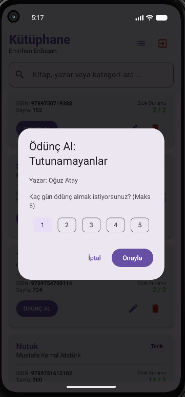
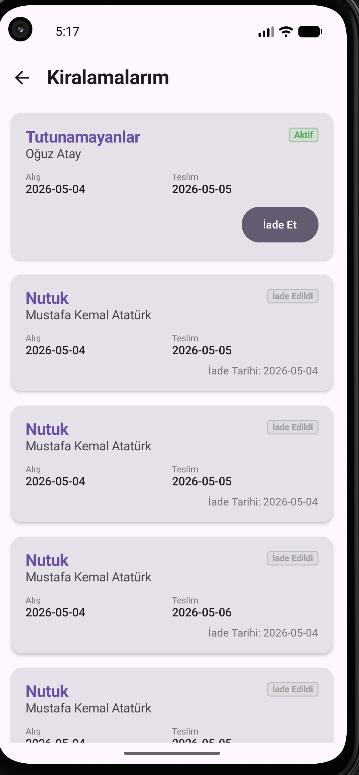
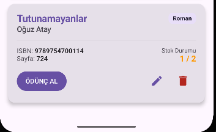

# Library App with Supabase

## Proje Özeti
Bu proje, Supabase altyapısını kullanan bir kütüphane yönetim uygulamasıdır. Kullanıcıların kayıt olabileceği, giriş yapabileceği ve kütüphanedeki kitapları yönetebileceği modern bir Android uygulamasıdır.

## Kullanılan Teknolojiler
*   **Kotlin** & **Jetpack Compose**
*   **Material 3**
*   **Supabase** (Auth & Postgrest)
*   **MVVM Mimari Yapısı**
*   **Kotlin Coroutines & Flow**
*   **Ktor**
*   **Serialization JSON**

## Özellikler
*   **Supabase Auth:** Email/Şifre ile güvenli kayıt ve giriş işlemleri.
*   **Profil Yönetimi:** `profiles` tablosuna kullanıcı bilgilerinin (ad-soyad, rol vb.) otomatik kaydı.
*   **Kitap Listeleme:** Kütüphanedeki tüm kitapların anlık olarak listelenmesi.
*   **Kitap Arama:** Başlık, yazar veya kategoriye göre gelişmiş filtreleme.
*   **Kitap Düzenleme:** Mevcut kitap bilgilerinin (stok, isim vb.) güncellenmesi.
*   **Kitap Silme:** Kitapların veritabanından güvenli bir şekilde kaldırılması.
*   **Modern UI:** Material 3 standartlarında, kullanıcı dostu arayüz.
*   **Ödünç Alma Sistemi:**
    *   Kitap kartlarında stok durumuna göre “ÖDÜNÇ AL” butonu veya “STOKTA YOK” göstergesi gösterilir.
    *   Kullanıcı kitap ödünç alırken 1-5 gün arası süre seçebilir.
    *   Ödünç alma sonrası Supabase `borrow_records` tablosuna kayıt eklenir.
    *   Ödünç alma sonrası `books` tablosunda `available_copies` değeri 1 azaltılır.
    *   Kullanıcı “Kiralamalarım” sayfasında aktif ve geçmiş kiralamalarını görebilir.
    *   İade Et özelliği ile kitap iade edilebilir ve stok tekrar artırılır.

## Yapılan Ödevler

### Ödev 1: Kayıt Ol Ekranı Başarı Yapısı
*   Kayıt işlemi başarılı olduğunda kullanıcıya net bir geri bildirim (Toast/State) verilir.
*   Başarılı kayıt sonrası kullanıcı otomatik olarak Giriş (Login) ekranına yönlendirilir.

### Ödev 2: Repository ve CRUD Mantığı
*   `BookRepository` içine `updateBook`, `deleteBook` ve `searchBooks` fonksiyonları eklendi.
*   `BookViewModel` üzerinden liste yenileme, silme ve güncelleme işlemleri yönetilmektedir.

### Ödev 3: Kitap Kartı ve UI Bileşenleri
*   `BookCard` adında bağımsız bir Composable bileşen tasarlandı.
*   Kitaplar düz liste yerine gölgelendirmeli ve düzenli kart yapısı ile gösterilir.
*   Arama alanı ve boş durum (empty state) mesajları eklendi.

### Ödünç Alma Ödevi
*   `borrow_records` tablosu ve RLS policyleri oluşturuldu.
*   `availableCopies > 0` ise ÖDÜNÇ AL butonu gösterildi.
*   `availableCopies <= 0` ise STOKTA YOK göstergesi gösterildi.
*   Maksimum 5 günlük ödünç alma kuralı uygulandı.
*   Kiralamalarım sayfası oluşturuldu.
*   Giriş yapan öğrencinin kiralama kayıtları listelendi.

## Türkçe Karakter Destekli Arama
Uygulama, Türkçe karakterlere (ç, ğ, ı, ö, ş, ü) duyarlı bir normalizasyon algoritmasına sahiptir.
*   Kullanıcı "yasar" yazdığında "Yaşar Kemal" sonucuna ulaşabilir.
*   Kullanıcı "ince" yazdığında "İnce Memed" sonucuna ulaşabilir.
*   Arama işlemi büyük/küçük harf duyarsızdır.

## Ekran Görüntüleri


### Ödünç Alma Dialogu


### Kiralamalarım Sayfası


### Stok Güncellenmiş Kitap Kartı


## Proje Yapısı
```
com.turkcell.libraryapp
├── data
│   ├── model           # Veri modelleri (Book, Profile, BorrowRecord)
│   ├── repository      # Veri kaynakları (AuthRepository, BookRepository)
│   └── supabase        # Supabase istemci yapılandırması
├── ui
│   ├── navigation      # Navigasyon (NavGraph, Screen)
│   ├── screen          # Ana ekranlar (Login, Register, Home, BorrowRecords, Splash)
│   │   └── components  # UI Bileşenleri (BookCard, BorrowRecordCard)
│   └── viewmodel       # ViewModel sınıfları (AuthViewModel, BookViewModel)
```

## Supabase Yapısı
Projeyi çalıştırmak için proje ana dizinindeki `local.properties` dosyasına şu değerler eklenmelidir:

```properties
SUPABASE_URL=YOUR_SUPABASE_URL
SUPABASE_ANON_KEY=YOUR_SUPABASE_ANON_KEY
```

### Veritabanı Tabloları
*   **books:** Kitap bilgilerini tutar (title, author, available_copies, total_copies vb.).
*   **profiles:** Kullanıcı rollerini ve isimlerini tutar.
*   **borrow_records:** Ödünç alma kayıtlarını tutar:
    *   `id` (uuid)
    *   `user_id` (uuid)
    *   `book_id` (uuid)
    *   `book_title` (text)
    *   `book_author` (text)
    *   `borrowed_at` (timestamptz)
    *   `due_date` (date)
    *   `returned_at` (timestamptz)
    *   `status` (text)

## Geliştirici
Emirhan Erdoğan
